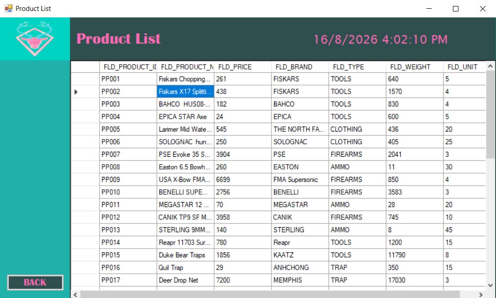
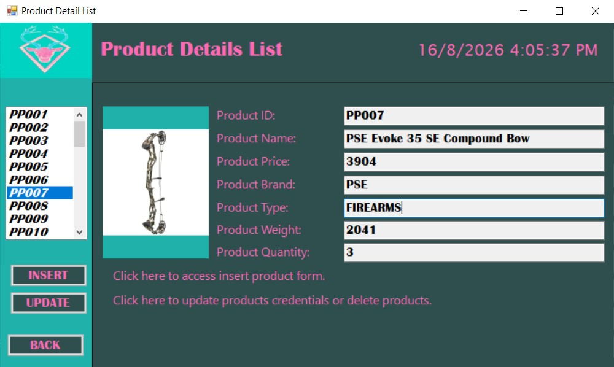
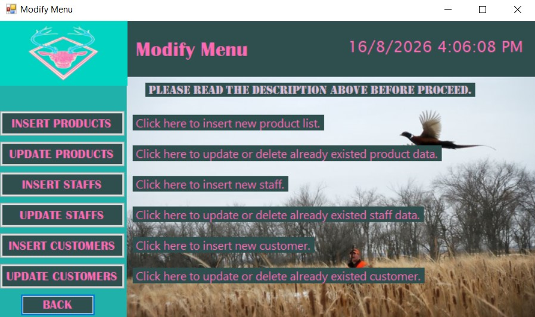
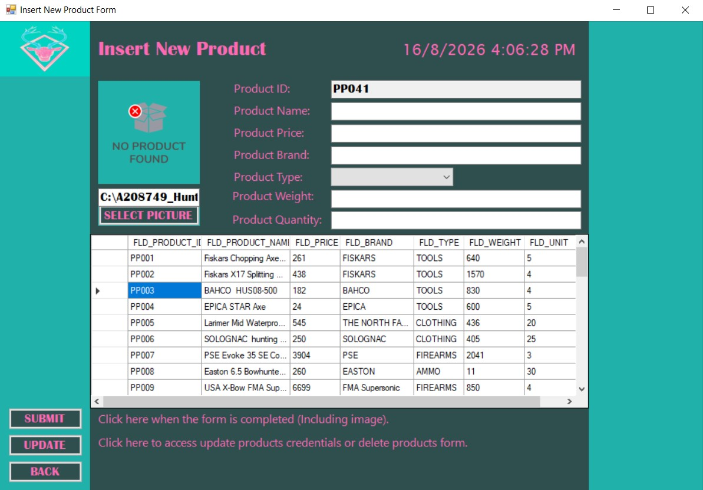

# Hunting Gear Warehouse

Hunting Gear Warehouse is a Windows desktop application for managing hunting-gear inventory and store records. It is built with VB.NET Windows Forms and stores data in a local Microsoft Access database.

## Features

- View products, customers, staff, orders, and invoices.
- Add, update, and delete products, customers, and staff.
- View detailed product information and product images.
- Generate IDs automatically for new records.
- Validate product price, weight, and quantity before saving.

## Screenshots

| Product list | Product details |
| --- | --- |
|  |  |
| **Modify menu** | **Add product** |
|  |  |

## Built With

- Visual Basic .NET
- Windows Forms
- .NET Framework 4.7.2
- Microsoft Access and ACE OLE DB 12.0

## Requirements

- Windows
- Visual Studio 2019 or newer with the **.NET desktop development** workload
- .NET Framework 4.7.2 Developer Pack
- Microsoft Access Database Engine with the `Microsoft.ACE.OLEDB.12.0` provider

## Running the Project

1. Clone this repository:

   ```powershell
   git clone https://github.com/HakimiFury/Hunting-Gear-Warehouse-.NET.git
   ```

2. Open `prj_huntinggearwarehouse_a208749.sln` in Visual Studio.
3. Build the solution using the **Debug** configuration.
4. Place these required runtime files in `prj_huntinggearwarehouse_a208749\bin\Debug\`:

   - `DB_huntinggearwarehouse_a208749.accdb`
   - A `pictures` folder containing `nophoto.jpg` and the product images

5. Press `F5` in Visual Studio to run the application.

> **Note:** The database and runtime product images are not tracked in this repository. A fresh clone requires these files before the database-backed screens can work. Use only sample or sanitized data if you decide to publish an Access database in this public repository.
